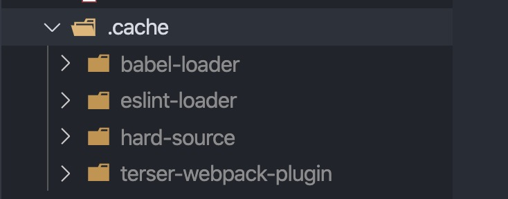
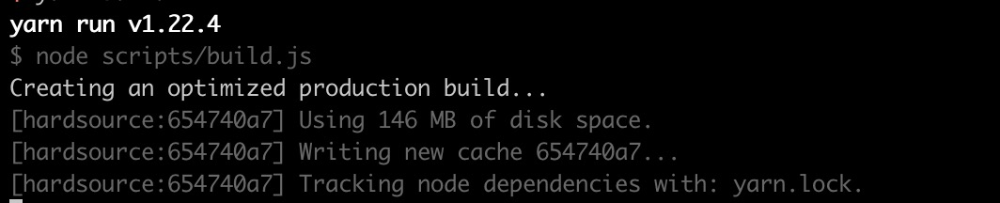
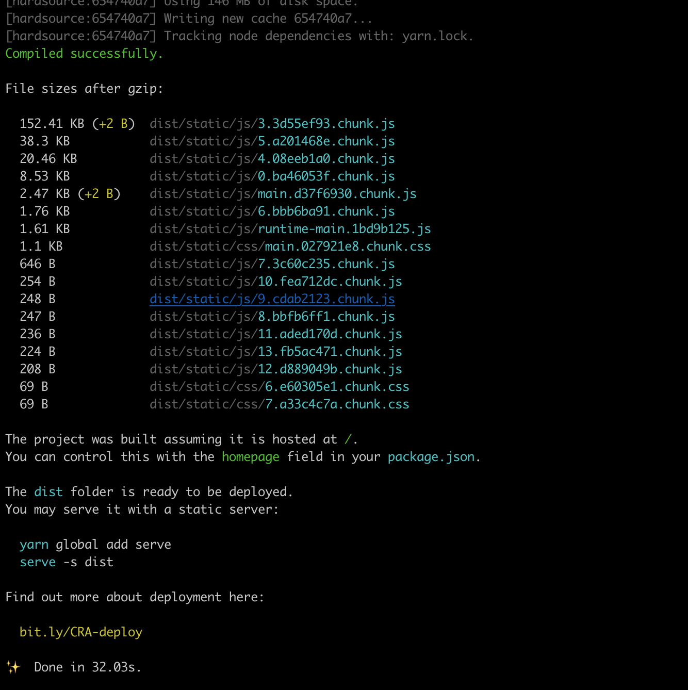
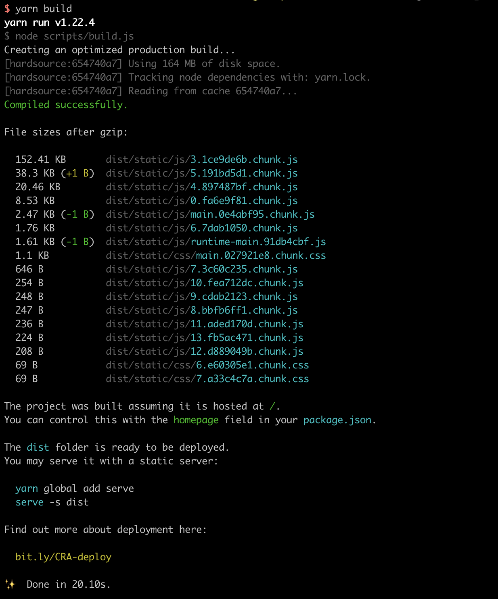

随着 Web 页面的日益复杂，性能优化已经成为了开发人员最关心的话题之一，无论是项目上线后，用户访问和使用 Web 应用，还是在项目上线之前的构建编译、静态资源的压缩处理，性能优化都是无法避免的问题。Webpack 凭借着其强大的功能、深度可定制性、迭代更新快等获得了大部分的前端开发人员的青睐，只要是前端应用开发，在打包构建这一块几乎都是选择 Webpack，Gulp、Parcel 等只是沦为小众项目或者一些少数场景下的选项。Webpack很强大，但是也很复杂，复杂必定会导致难以避免的性能问题，特别是在构建一些大型项目的时候。于是，性能优化成为了掌握 Webpack 不可或缺的一项技能。本文主要从多进程构建、缓存、预编译部分资源等方面介绍 Webpack 的性能优化。

### 多进程实例构建
我们知道 Webpack 是一个运行在 Node 端的工具，而 Node 作为一个 `JavaScript` 服务端的运行环境，我们可以充分利用多进程的优势提高 `Webpack` 的构建速度。

在 Webpack4 中，对于 JS 的解析优化，默认使用 [Terser](https://github.com/terser/terser)，而且内置了 `terser-webpack-plugin` 插件。我们知道 `Webpack` 中主要处理的都是 JS，所以对于 JS 的压缩和优化必定非常耗时。`TerserPlugin` 提供了一个选项：`parallel`，它可以是一个数字或者是一个布尔值，将这个选项设置为 `true` 后，就能在构建的时候使用多进程，提高构建速度。不过这个选项默认是开启的，也可以通过设置数字告诉 `Webpack` 构建的时候使用多少个进程。无论是使用 `Terser` 还是使用 `Uglify` 都是有类似的开启多进程解析和优化 JS 的功能，如果在我们自己定制配置的时候，记得开启选项。 

```js
const TerserPlugin = require('terser-webpack-plugin');

module.exports = {
  optimization: {
    minimize: true,
    minimizer: [
      new TerserPlugin({
        parallel: true
      })
    ],
  },
};
```

除了上面提到的插件之外，Webpack 社区和官方都有提供其它的插件和 `loader`，使得我们可以进一步利用服务端的多进程优势。

#### HappyPack
这是一个社区里的解决方案，在 `Webpack` 比较早期的版本，它可以用来协助 Webpack 使用多进程构建，当然它也需要配合 `loader` 一起使用，不过随着 `Webpack` 不断的升级，作者认为使用 `HappyPack` 的提升不大，如果你在使用低版本的 `Webpack` 可以考虑使用此插件。

它的使用也很简单，我们看一个例子：
```js
const HappyPack = require('happypack')

exports.module = {
  rules: [
    {
      test: /.js$/,
      // 1) replace your original list of loaders with "happypack/loader":
      // loaders: [ 'babel-loader?presets[]=es2015' ],
      use: 'happypack/loader',
      include: [ /* ... */ ],
      exclude: [ /* ... */ ]
    }
  ]
};

exports.plugins = [
  // 2) create the plugin:
  new HappyPack({
    // 3) re-add the loaders you replaced above in #1:
    loaders: [ 'babel-loader?presets[]=es2015' ]
  })
];
```
当然，插件还有很多其它的选项，例如 `threads`，告诉插件应该开启多少个进程构建。更多详细的配置可以前往 [Github](https://github.com/amireh/happypack) 查看。

#### thread-loader
如果你使用的是 `Webpack4`，官方更加推荐你使用 `thread-loader`，这也是 `Webpack` 官方维护的插件，非常靠谱。官网建议，只有在一些开销比较大的 `loader` 中使用，这样才能比较好地起到作用。我们先看它的使用：
```js
module.exports = {
  module: {
    rules: [
      {
        test: /\.js$/,
        include: path.resolve("src"),
        use: [
          "thread-loader",
          // your expensive loader (e.g babel-loader)
        ]
      }
    ]
  }
}
```
对于像 `babel-loader` 这样的开销比较大完全可以使用 `thread-loader` 开启多进程构建，`thread-loader` 默认会开启两个线程池，如果想要自己定义，可以通过设置 `workers` 选项：
```js
module.exports = {
  module: {
    rules: [
      {
        test: /\.js$/,
        include: path.resolve("src"),
        use: [
          {
            loader: "thread-loader",
            options: {
              workers: 3
            }
          },
          // your expensive loader (e.g babel-loader)
        ]
      }
    ]
  }
}
```
对于开启多进程加速 `Webpack` 的构建基本思路就是，如果使用了一些开销比较大的 `JS` 处理插件，记得开启多进程处理选项。如果要加速 `loader` 处理，可以使用 `thread-loader`。

### 缓存
缓存无论是在什么场景下都是适用的，特别是对于 `Webpack` 这么大型的构建工具，一定的缓存是必不可少的。既然是缓存，肯定是下一次构建的时候才能看到效果，对于构建的处理，我们不只是需要一次，它是贯穿整个应用迭代过程中，所以缓存必定能有不错的效果。

对于处理 `JS` 的代码，无论是 `babel-loader` 还是 `terser` 插件，同样内置了缓存的功能。对于 `babel-loader`，通过设置 `cacheDirectory` 选项来开启缓存功能，默认是不开启的，所以需要我们手动开启。
```js
module: {
  rules: [
    {
      test: /\.m?js$/,
      exclude: /(node_modules|bower_components)/,
      use: {
        loader: 'babel-loader',
        options: {
          presets: ['@babel/preset-env'],
          cacheDirectory: true
        }
      }
    }
  ]
}
```
开启后，每次构建结束，我们就能在 `node_modules` 下的 `.cache` 目录下看到：

 

`babel-loader` 目录就是用来存放其对应的缓存资源，下一次构建就会从这个目录下读取缓存的资源。

`terser-webpack-plugin` 也同样有类似的功能，通过选项 `cache` 开启，不过这个是默认开启的。从刚才的截图中，我们也看到了 `terser-webpack-plugin` 的目录，这也是存放其相关缓存资源的目录。

除了上面提到的两个点之外，我们也可以使用插件，进一步缓存 `Webpack` 构建的结果。

`HardSourceWebpackPlugin` 是一个比较常用的插件之一，它主要是通过缓存模块来达到减少下一次构建时间的目的。使用也非常简单：
```js
var HardSourceWebpackPlugin = require('hard-source-webpack-plugin');

module.exports = {
  context: // ...
  entry: // ...
  output: // ...
  plugins: [
    new HardSourceWebpackPlugin()
  ]
}
```
添加完这个插件之后每次构建，我们就能看到此插件的日志：



从图中我们看到此插件上一次构建已经缓存了 `146M` 资源，每次构建还会继续写入新的缓存，使用了此插件还对构建的效率有很大的提升。下面是一个第一次构建和下一次构建的对比图：



下一次构建：



除了使用插件，官网同样也提供了一个 `cache-loader` 来缓存一些开销比较大的 `loader`，只要在我们配置的 `loader` 之前加上 `cache-loader`，它就能自动帮我们去做一些缓存。
```js
module.exports = {
  module: {
    rules: [
      {
        test: /\.ext$/,
        use: [
          'cache-loader',
          ...loaders
        ],
        include: path.resolve('src')
      }
    ]
  }
}
```  
因为保存和读取缓存也是需要一些开销的，所以只有当我们确定某些资源的处理开销比较大的时候再添加 `cache-loader`，否则可能会产生相反的作用。

### 分包预编译资源
上面介绍的两种方式都是针对 Webpack 在构建过程中进行的优化，如果有一种方式可以让我们减少对资源的处理那不是更好了。在我们的开发过程中，大多数情况下我们都会使用一些框架或者类库，如果我们直接引入到入口文件中，那么每次打包构建的时候都需要重新编译处理。但大多数情况下，我们的类库或者框架，在项目首次引入之后就很少会改变，利用这样的思路，我们可以通过一种方式，将大型的框架或类库单独编译，然后在项目中引用。以后每次只需要在我们更新框架的版本时再重新编译一次就行，这样就减少了构建的资源。

凭借前面的思路，官网已经为我们提供了解决方案：DLLPlugin 和 DLLReferencePlugin，下面我们看下怎么使用。

首先我们为此类的资源创建单独的配置，这里我们叫 `webpack.dll.conf.js`，它的内容如下
```js 
const path = require('path');
const webpack = require('webpack');
module.exports = {
  entry: {
    vendor: [
      'vue/dist/vue.esm.js',
      'vue-router',
      'vuex',
      'element-ui',
      'axios'
    ]
  },
  output: {
    path: path.join(__dirname, '../dist/js'),
    filename: 'dll.[name]_[hash:6].js',
    library: '[name]_[hash:6]'
  },
  plugins: [
    new webpack.DllPlugin({
      path: path.join(__dirname, '.', '[name]-manifest.json'),
      name: '[name]_[hash:6]'
    })
  ]
}
```
在这里，我们将 `vue`、 `vue-router`、`vuex`、`elemnt-ui`、`axios` 等资源抽离出来，打包成单独的 `vendor`，除了生成 `vendor`之外 ，它还会生成一个清单文件，用于后面的 `DLLReferencePlugin` 查找资源。注意，我们需要在项目运行之前，单独运行 Webpack 命令来构建 `vendor` 资源，或者在更新上面的类库的版本后重新构建一次，其它的情况下就不需要管了。

接着，我们在项目的 `webpack.config.js` 中通过 `DLLReferencePlugin` 引用上面的资源：
```js
const webpack = require('webpack')

module.exports = [
  plugins: [
    new webpack.DllReferencePlugin({
     context: '.',
     manifest: require("./dist/vendor.manifest.json"),
    })
]
```
这样我们就完成了对于一些不经常变化的类库资源的单独打包，减少了我们在开发过程中，对于业务代码打包的时间。当然，此功能除了可以用来提升一定的构建速度外，也可以将这类资源分包，充分利用浏览器的缓存，提升应用对资源的加载速度。

### 缩小构建目标
在 Webpack中，有一些配置项是来告诉 `Webpack` 去哪里扫描文件、应该扫描哪些文件类型，这样能一定程度上提高资源的扫描效率。

在 `loader` 中通过配置 `include` 选项或者 `exclude` 选项来告诉当前 `loader` 应该处理什么目录下的文件或者不处理什么目录下的文件。例如：
```js
const path = require('path)

module.exports = [
  module: {
    rules: [
      {
        {
          test: /\.(js|mjs|jsx|ts|tsx)$/,
          include: path.resolve(__dirname, 'src'),
          exclude: path.resolve(__dirname, 'node_modules')
      }
    ]
  }
]
```
这样就减少了 `loader` 文件查找的范围。

我们还可以通过配置 `resolve.extensions` 选项来告诉 `webpack` 需要处理哪些类型的资源：
```js
module.exports = {
  //...
  resolve: {
    extensions: ['.ts', '.js', '.vue']
  }
}
```
 而配置 `resolve.mainFields` 选项，可以告诉 `Webpack` 在 `import` 模块的时候去加载哪个文件作为当前导入的模块，这对于引入 `node_modules` 下的资源具有一定的作用，因为我们通常通过 `package.json` 文件去告诉工具应该加载哪个文件。
 ```js
module.exports = {
  //...
  resolve: {
    mainFields: ['browser', 'module', 'main']
  }
};
 ``` 
 `resolve.modules` 选项告诉 `webpack` 去哪里查找模块，默认是 `node_modules` 目录，如果你还有其它的目录，可以通过此选项配置：
 ```js
 module.exports = {
  //...
  resolve: {
    modules: ['node_modules', 'other_modules']
  }
};
 ```
以上的选项配置，能一定程度上提高 `Webpack` 加载资源的效率，特别是对于复杂的应用，资源越多，那么这些 `resolve` 配置就能发挥不错的效果。

#### 最后
当然除了以上列的这些，还有一点需要注意的是，保持 `Node` 和 `Webpack` 版本的更新。新版本的 `Node` 环境也好，`Webpack` 的版本升级也好，总是会带有一些扣人心弦的优化，这些优化能比老久的版本构建效率更高。所以，时刻关注官方博客，跟进版本的升级。

以上是我对 `Webpack` 性能优化这个老生常谈的问题的一些总结，如有不当之处，烦请指出。


